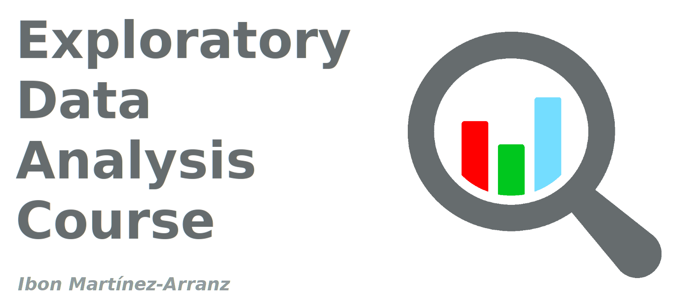

# Exploratory Data Analysis Course

## Table of Content

  * data: A csv file with data.
    * 2018\_Central\_Park\_Squirrel\_Census\_-\_Squirrel\_Data.csv
  * documents: pdf files 
    * Data_in_Support_of_Enhancing_Metabolomics_Research_Through_Data_Mining.pdf
    * Robinson-icebreaker.pdf
  * images: images for presentation
  * ipynb: Jupyter notebbok and slides
    * presentation.ipynb
    * presentation_slides.html
  * notes: 
    * nbconvert.txt: command to generate the html slides
  * scripts: Python scripts and R scripts
    * dataframe\_outlier\_pca.py
    * dataframe\_outlier.py
    * distances.py
    * heterocedasticidad\_no\_normalidad.py
    * heterocedasticidad.py
    * mahalanobis\_example\_01.py
    * mahalanobis\_example\_02.py
    * pca.py
    * qqplot.py
    * shapiro_example_01.py
    * shapiro_example_02.py
    * tboxcox.R  

### Generate Slides

```
jupyter nbconvert presentation.ipynb --to slides --reveal-prefix reveal.js --no-prompt --SlidesExporter.reveal_theme=white --SlidesExporter.reveal_transition=slide --TagRemovePreprocessor.remove_input_tags={\"hide\"}
```

### Git Clone

How to access the course via git

```
git clone https://github.com/imarranz/EDA_Course.git
```

How to acces the course via web

https://github.com/imarranz/EDA_Course

### Utilities

  * [pandas profiling](https://github.com/pandas-profiling/pandas-profiling)

### Tutorials

  * [10 minutes to pandas](https://pandas.pydata.org/pandas-docs/stable/getting_started/10min.html)  
  
  * [SciPy Tutorial](https://docs.scipy.org/doc/scipy/reference/tutorial/general.html)  
  
  * [PyPlot Tutorial](https://matplotlib.org/tutorials/introductory/pyplot.html)  
  
  * [An Introduction to seaborn](https://seaborn.pydata.org/introduction.html)  